## Information

| Field | Value |
|---|---|
| Name | Mohammad Ibrahim |
| Roll Number | 27100085 |
| GitHub Repository URL | https://github.com/MIbrahim-17/CS487-PA4 |
| Resource Group | `rg-sp26-27100085` |
| Assigned Region | `ukwest` (UK West) |

## Task 1: App Service Web App (15 points)

### Task 1 — Forked GitHub Repository

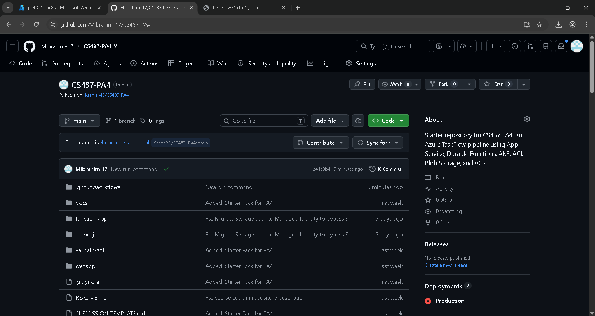

The screenshot showed the GitHub repository at https://github.com/MIbrahim-17/CS487-PA4 with the full PA4 starter directory structure visible, confirming the fork had been created from the course starter repository. The repository contained all required directories — `webapp/`, `function-app/`, `validate-api/`, `report-job/`, and `docs/` — establishing the working foundation for all subsequent Azure deployments.

### Task 1 — App Service Overview

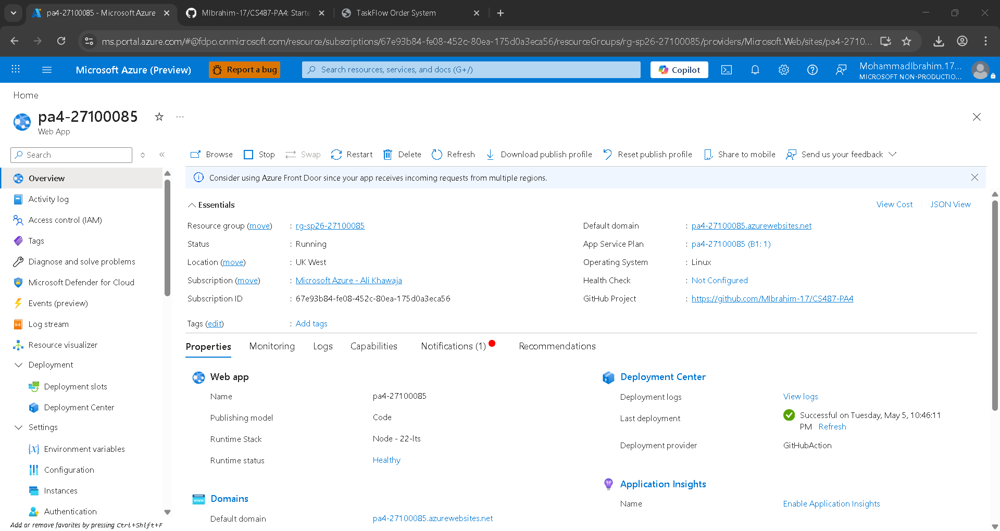

The Azure Portal App Service overview page displayed the `pa4-27100085` Web App resource in resource group `rg-sp26-27100085`, deployed in the UK West region with a Node.js runtime stack and a Running status. The overview confirmed the public URL at https://pa4-27100085.azurewebsites.net and the B1 App Service plan assigned to host the application.

### Task 1 — Deployment Center and GitHub Actions

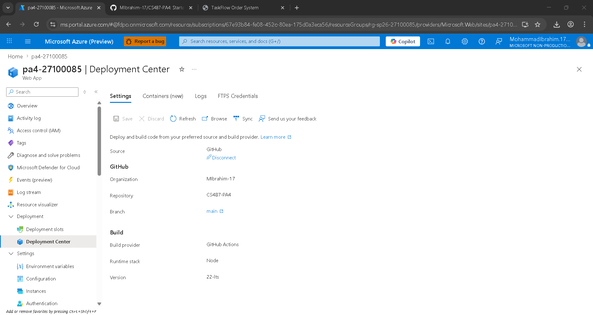

The Deployment Center configuration page showed the `pa4-27100085` Web App connected to the GitHub fork at MIbrahim-17/CS487-PA4 using GitHub Actions as the CI/CD provider, with the main branch selected as the deployment source. This integration ensured that every push to the repository automatically triggered a workflow to build and redeploy the Node.js application to the App Service host.

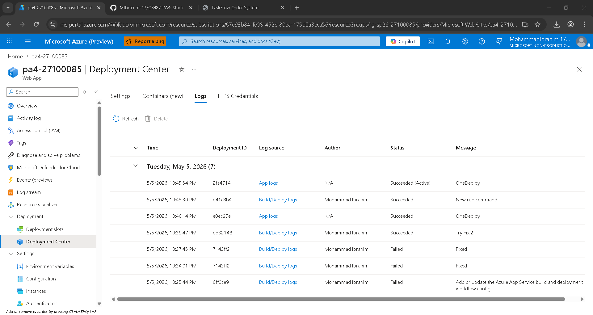

The Deployment Center deployment history confirmed that the most recent GitHub Actions run completed with a Succeeded status, including a commit reference and timestamp. This verified that the automated pipeline from the GitHub source repository to the Azure App Service environment was fully operational and had delivered the latest commit to production.

### Task 1 — Live TaskFlow Dashboard

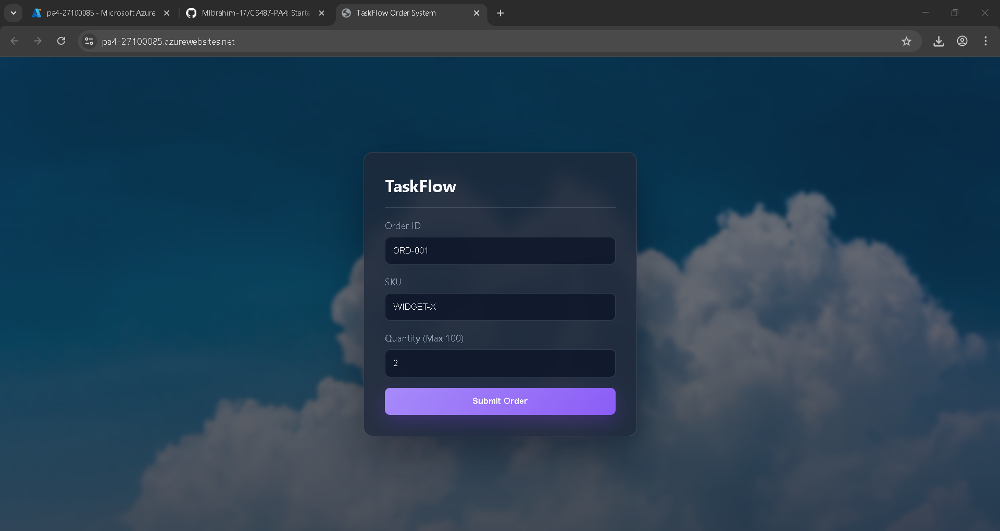

The browser loaded the TaskFlow order submission dashboard at https://pa4-27100085.azurewebsites.net, confirming the App Service was serving the Node.js Express application and all static assets from `webapp/public/` correctly. The order form rendered as expected, demonstrating end-to-end delivery of the web frontend from the App Service host to the client browser.

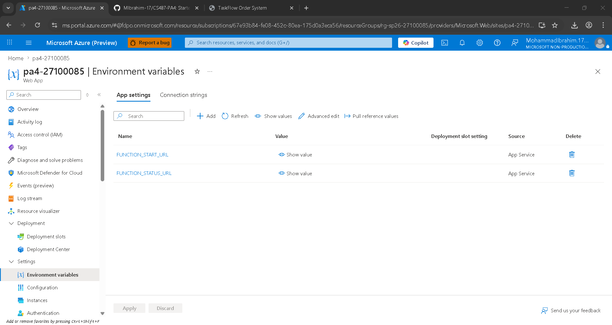

The App Service application settings page displayed `FUNCTION_START_URL` set to the `http_starter` endpoint on `pa4--27100085-e2bvhvcjcwe3awdw.ukwest-01.azurewebsites.net` and `FUNCTION_STATUS_URL` for polling Durable orchestration status. These two settings wired the Node.js frontend to the Azure Durable Function backend, enabling the web app to start new orchestrations and poll their completion without hard-coding Function App endpoint URLs.

---

## Task 2: Azure Container Registry (15 points)

### Task 2 — ACR Overview

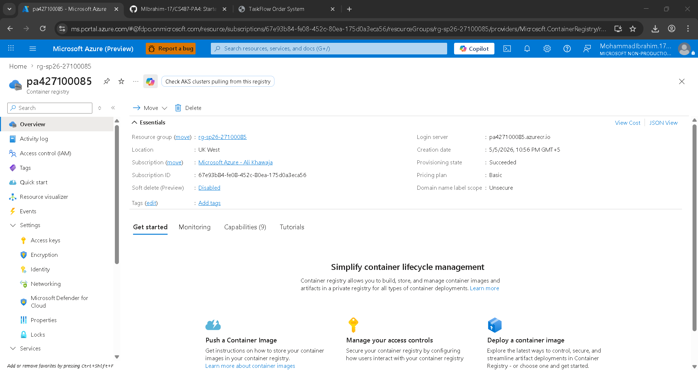

The Azure Container Registry overview page for `pa427100085` displayed the registry endpoint at `pa427100085.azurecr.io` in resource group `rg-sp26-27100085` with a Succeeded provisioning state and Standard SKU. The overview confirmed the registry was ready to accept image pushes and serve images to the AKS cluster and the containerised Function App deployment.

### Task 2 — Docker Image Builds and Pushes

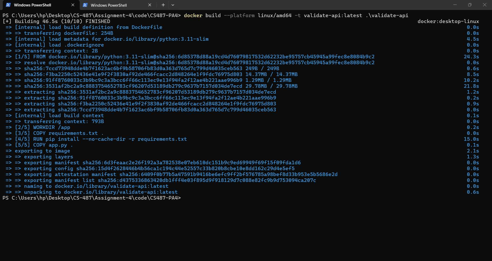

The terminal output showed the `docker build` command building the `validate-api` image from the `validate-api/` directory, with Docker downloading the Python base layers and executing the Dockerfile instructions in sequence. The image was tagged as `pa427100085.azurecr.io/validate-api:v1` in preparation for pushing to the Azure Container Registry.

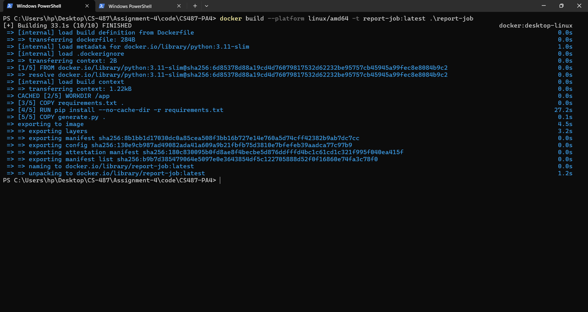

The terminal displayed the `docker build` output for the `report-job` image, showing Python dependency installation from `report-job/requirements.txt` and successful completion with the image tagged as `pa427100085.azurecr.io/report-job:v1`. This image would later be pulled by Azure Container Instances spawned by `report_activity` during each order's report generation step.

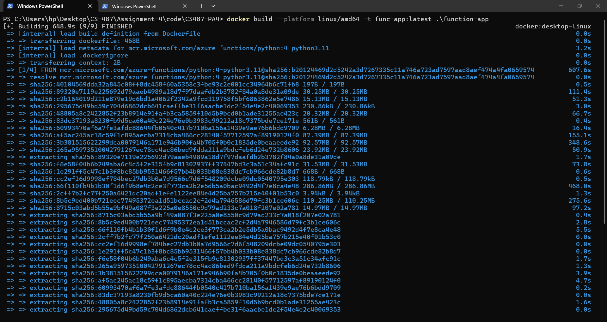

The terminal showed the `docker build` output for the `func-app` image built from the `function-app/` directory, with all Azure Durable Functions dependencies installed from `requirements.txt` and the image tagged as `pa427100085.azurecr.io/func-app:v1`. Completion of this third build confirmed that all three container images required by the TaskFlow pipeline had been constructed successfully on the local machine.

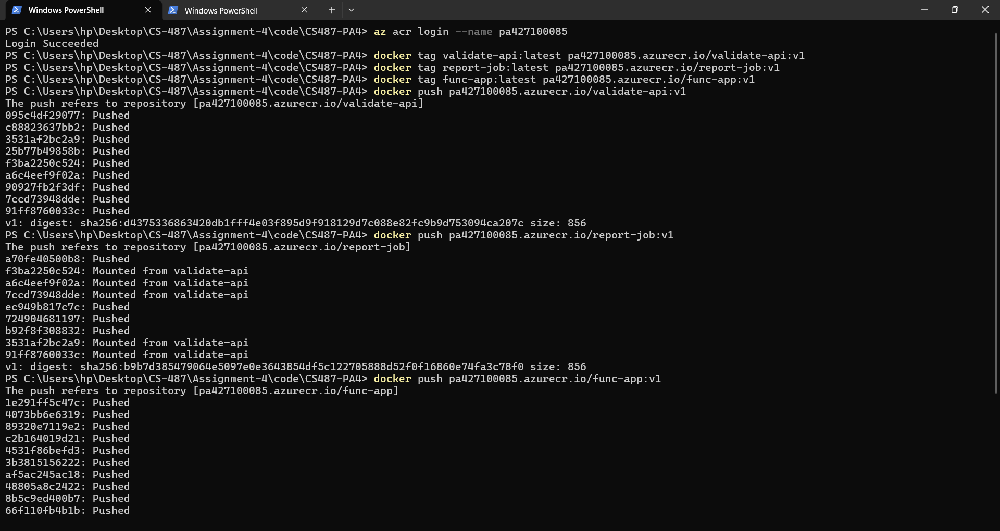

The terminal displayed the `docker push` command uploading the first image to `pa427100085.azurecr.io`, with individual layer upload progress visible and a digest hash returned by the registry upon successful completion. The successful push confirmed that `az acr login` had granted the local Docker daemon authenticated write access to the private registry.

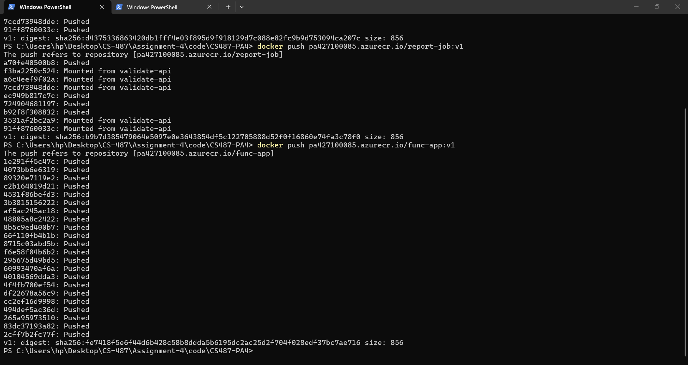

The terminal showed the `docker push` output for the second image upload to `pa427100085.azurecr.io`, with all layers transferred and a digest hash returned by the registry confirming the push was accepted. Together with the first push screenshot, this demonstrated that multiple images were successfully uploaded to the registry in sequence.

### Task 2 — ACR Repository Verification

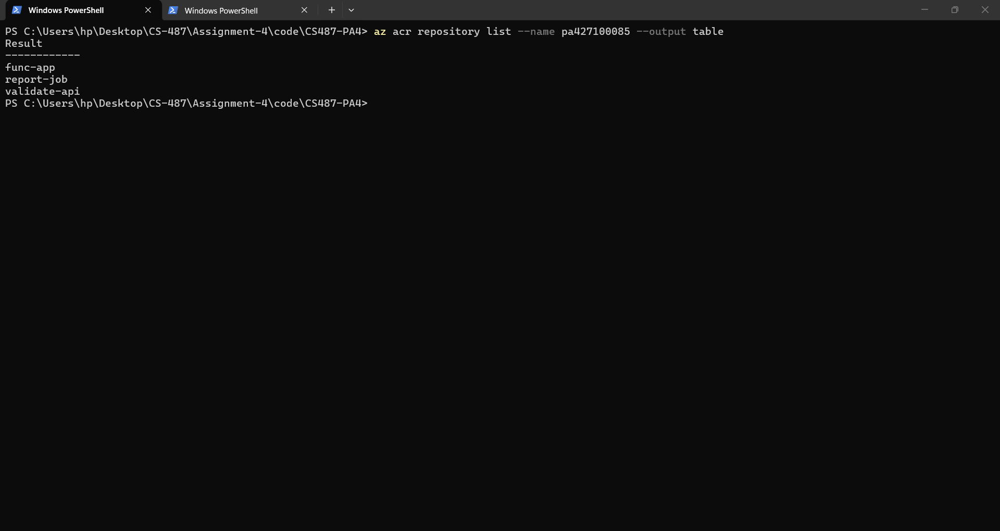

The `az acr repository list` command output listed three repositories — `validate-api`, `report-job`, and `func-app` — present in `pa427100085.azurecr.io`, confirming all three `v1`-tagged images had been pushed successfully. This verified that the complete set of container images required by the TaskFlow pipeline was available in ACR for deployment to AKS and the Function App.

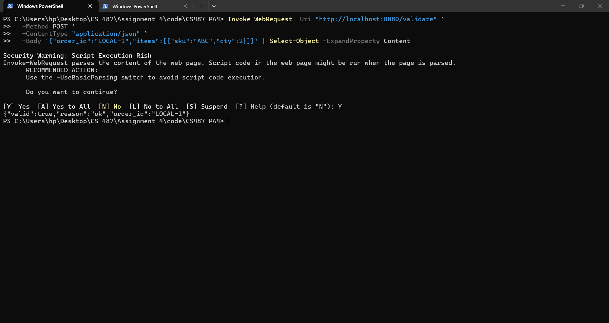

A `curl` POST request to the locally running `validate-api` container returned `{"valid": true}` for a valid order payload, confirming the image was built correctly and the FastAPI validation logic accepted orders with quantities within the allowed range. This smoke test was executed before pushing the image to ACR to verify the container behaved as expected.

---

## Task 3: Durable Function Implementation (12 points)

### Task 3 — Completed Function Code on GitHub

[function_app.py](function-app/function_app.py)

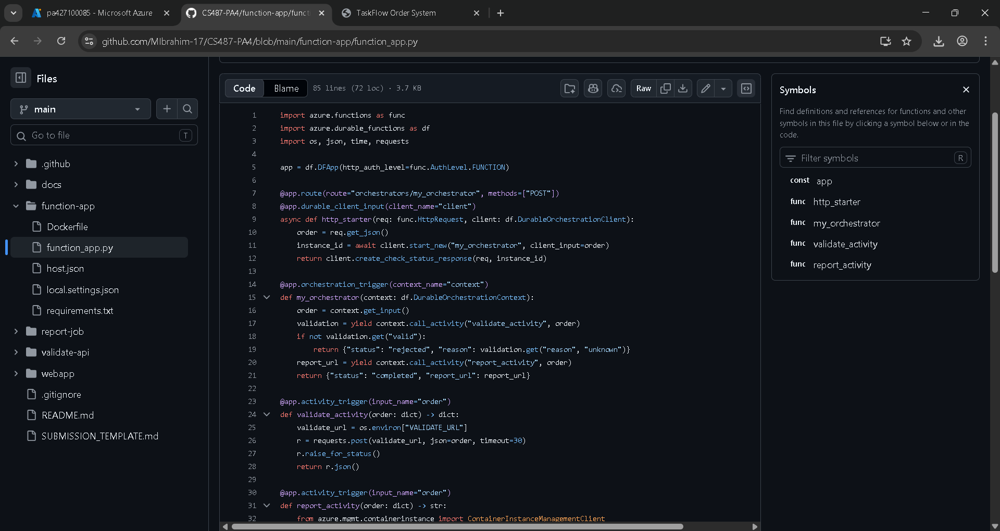

The GitHub file viewer displayed the completed `function-app/function_app.py` committed to the MIbrahim-17/CS487-PA4 repository, showing all four Durable Functions handlers: the `http_starter` HTTP trigger, the `my_orchestrator` orchestration function, `validate_activity`, and `report_activity`. The committed code confirmed the orchestrator logic — which chains validation via a POST to `VALIDATE_URL` before conditionally calling `report_activity` to spawn an ACI container and poll it until completion — was version-controlled and available for deployment.

### Task 3 — Deployed Function Handler Listing

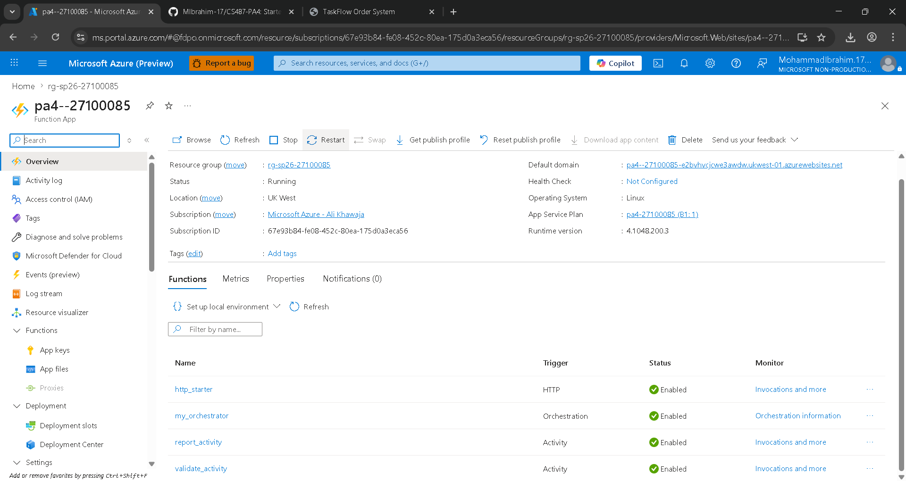

The Azure Portal Function App overview for `pa4--27100085` listed all four registered handlers — `http_starter`, `my_orchestrator`, `validate_activity`, and `report_activity` — confirming the containerised Durable Functions runtime had discovered and loaded all implemented functions. Local `func start` output was not captured because the Python 3.14 worker installed on the local machine was incompatible with the Azure Functions Core Tools runtime version; the Portal listing served as equivalent evidence that all handlers were registered and active in the deployed environment.

---

## Task 4: Function App Container Deployment (8 points)

### Task 4 — Function App Container Configuration

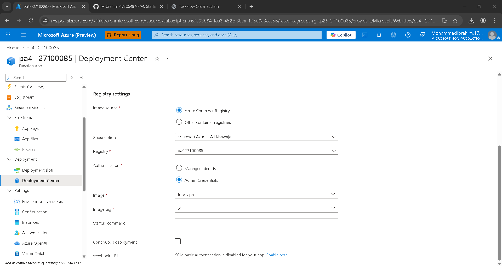

The Function App Deployment Center showed `pa4--27100085` configured to pull the `func-app:v1` container image from `pa427100085.azurecr.io`, confirming the Function App ran as a container-based deployment rather than a code-based one. The ACR image URI and tag were visible, establishing which version of the orchestrator code was active in the deployed environment.

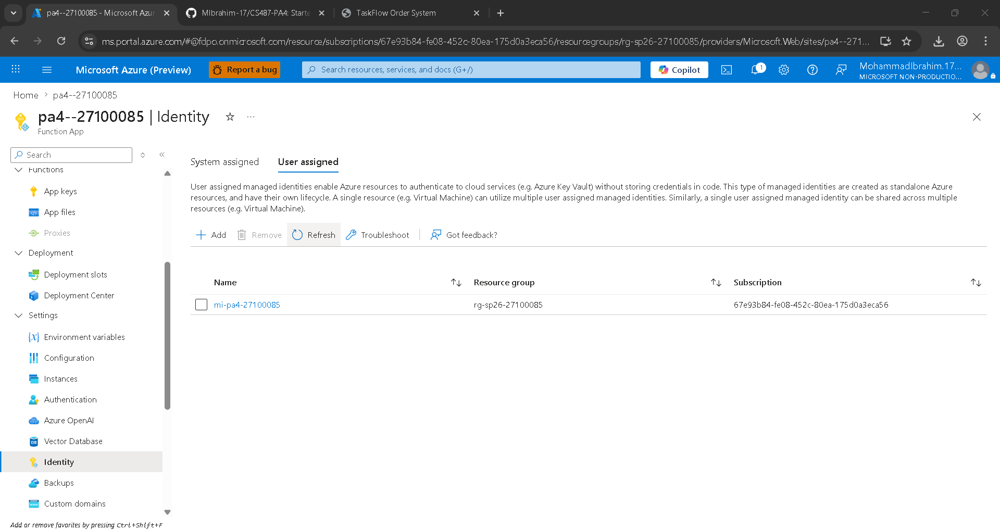

The Function App identity settings page displayed the user-assigned managed identity `mi-pa4-27100085` attached to `pa4--27100085`, granting it access to Azure Container Registry and the Container Instance Management API without embedding credentials in application settings. This identity was used by the Durable runtime for authenticated storage access and by `report_activity` when calling `ContainerInstanceManagementClient` to create per-order ACI container groups.

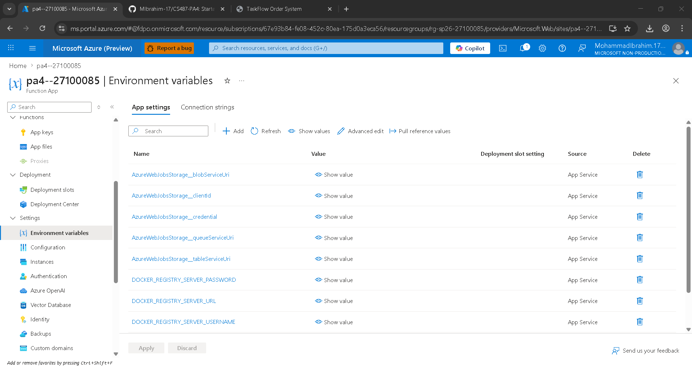

The application settings page for `pa4--27100085` displayed the storage authentication variables — `AzureWebJobsStorage__accountName`, `AzureWebJobsStorage__credential`, and `AzureWebJobsStorage__clientId` — replacing the traditional connection string that the instructor's subscription security policy blocked. These three settings together allowed the Durable Functions runtime to authenticate to the backing Azure Storage account using the attached managed identity rather than a static key.

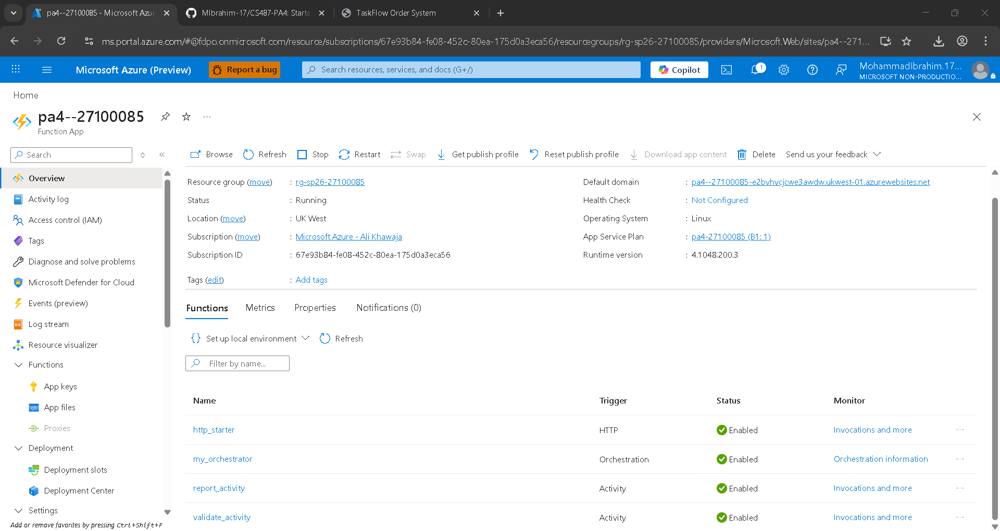

The Function App overview page listed the deployed functions registered under `pa4--27100085`, confirming the containerised `func-app:v1` image had started successfully and the Durable Functions runtime had loaded and exposed all four handlers. This portal-level view provided additional confirmation that the container deployment was healthy and the functions were ready to receive requests.

### Task 4 — Orchestration Smoke Test

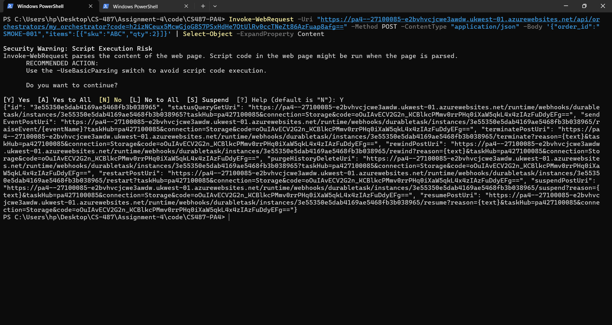

The terminal displayed a `curl` POST to the `http_starter` endpoint on `pa4--27100085-e2bvhvcjcwe3awdw.ukwest-01.azurewebsites.net`, with the Durable Functions runtime returning a JSON payload containing a new orchestration `id` and the `statusQueryGetUri` for polling progress. This confirmed the HTTP starter was reachable, authentication succeeded, and the Durable runtime successfully created a new orchestration instance from the submitted order payload.

### Task 4 — Expected Failed Status Before Downstream Wiring

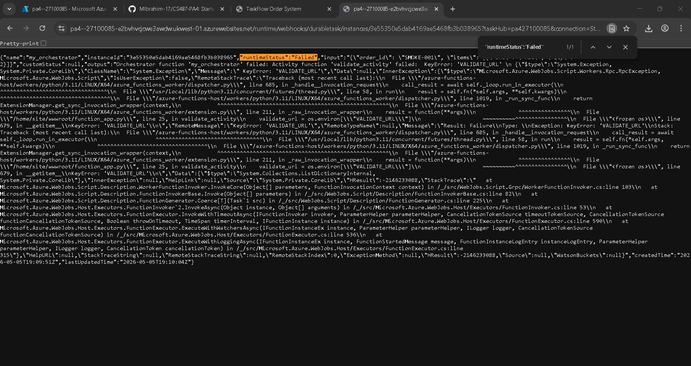

The `statusQueryGetUri` response showed the orchestration instance in a Failed runtime status because `VALIDATE_URL` had not yet been configured in the Function App application settings, causing `validate_activity` to raise a `KeyError` on `os.environ["VALIDATE_URL"]`. This failure was expected at the Task 4 stage and confirmed the orchestrator was executing correctly up to the validation step, before the downstream AKS service was wired in.

---

## Task 5: AKS Validator (15 points)

### Task 5 — AKS Cluster Node Ready State

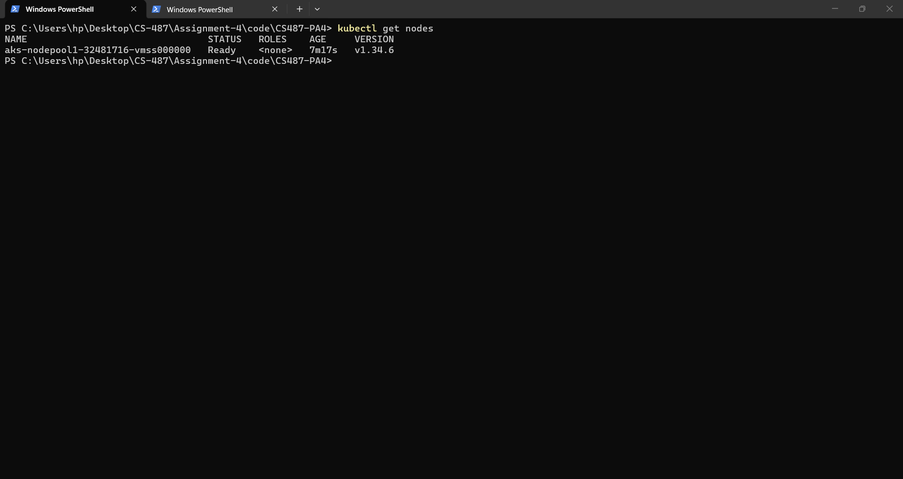

The `kubectl get nodes` command output confirmed the AKS cluster `pa4-27100085` was active with its single Standard_B2s worker node in a Ready status, indicating the cluster control plane and kubelet were communicating correctly. The cluster was deployed in the UK West region within resource group `rg-sp26-27100085` and was prepared to schedule the `validate-api` workload.

### Task 5 — Kubernetes Pods Running State

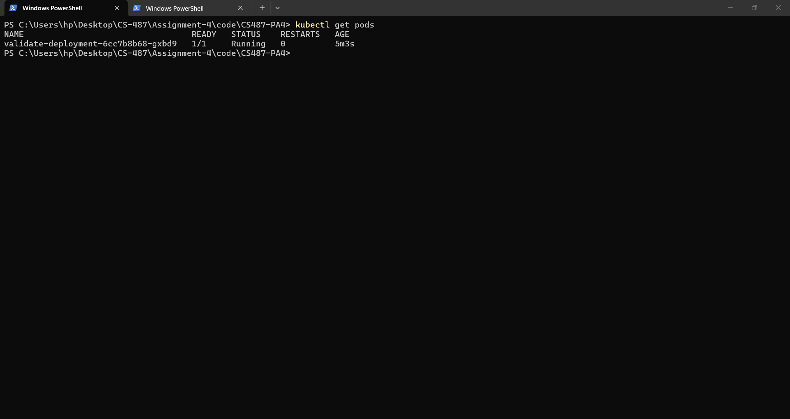

The `kubectl get pods` output displayed the `validate-api` deployment pod in a Running state with all containers marked ready, confirming the Kubernetes scheduler had placed and started the pod on the worker node. The running status indicated the `validate-api:v1` image was pulled successfully from `pa427100085.azurecr.io` and the FastAPI application started without errors.

### Task 5 — Kubernetes LoadBalancer Service

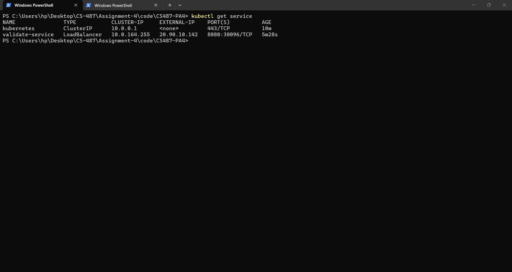

The `kubectl get service validate-service` output showed the LoadBalancer service type with an external IP address assigned by the Azure cloud provider and port 80 exposed to the internet. This external IP was the stable endpoint set in the Function App's `VALIDATE_URL` application setting, enabling `validate_activity` to reach the AKS-hosted validator from outside the cluster with each `requests.post` call.

### Task 5 — Validator API Tests

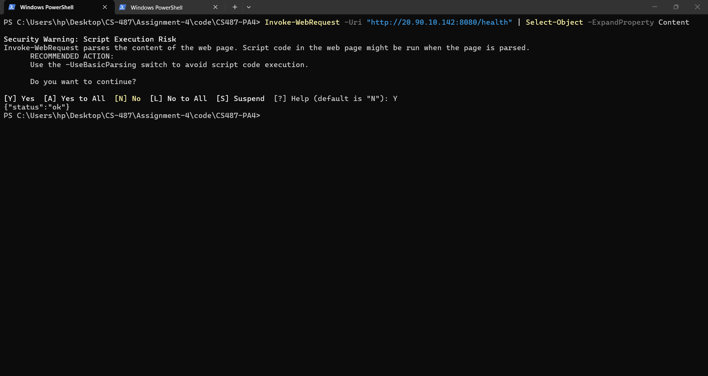

A `curl` request to the `/health` endpoint on the LoadBalancer external IP returned a healthy status response from the FastAPI application running inside the `validate-api` pod. This confirmed the AKS LoadBalancer service was correctly routing external HTTP traffic to the pod and the application was responsive before order validation was tested.

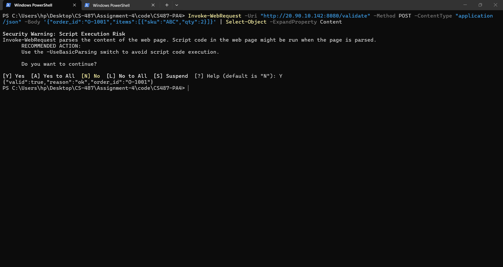

A `curl` POST to the `/validate` endpoint with an order payload containing a quantity within the accepted range received a `{"valid": true}` JSON response, confirming the happy-path validation logic in `validate-api/app.py` was operational after deployment to Kubernetes. This response structure matched what `validate_activity` expected — a dict with a `valid` key — and would cause `my_orchestrator` to proceed to the `report_activity` step.

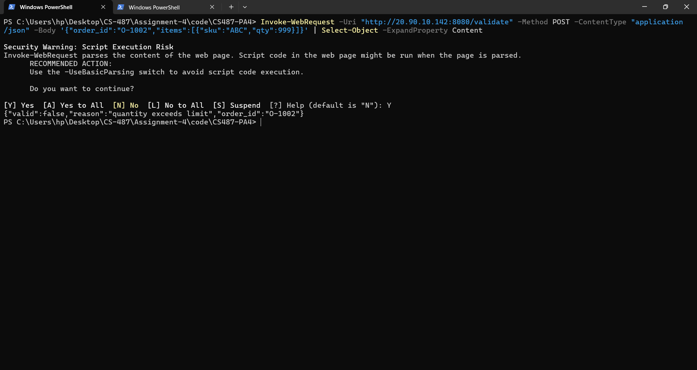

A `curl` POST to the `/validate` endpoint with an order where `qty` exceeded 100 received a `{"valid": false, "reason": ...}` response, confirming the rejection rule was correctly enforced by the deployed validator. This response would cause `my_orchestrator` to return `{"status": "rejected", "reason": ...}` immediately without calling `report_activity`, avoiding unnecessary ACI provisioning for invalid orders.

### Task 5 — Function App VALIDATE_URL Setting

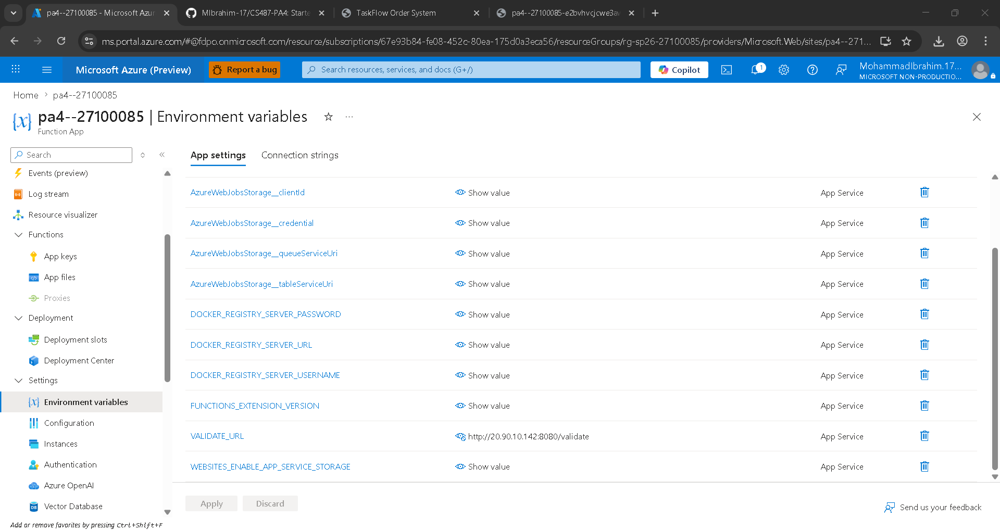

The Function App application settings page displayed the `VALIDATE_URL` environment variable set to the AKS LoadBalancer external IP address and the `/validate` path. This value was read by `validate_activity` at runtime via `os.environ["VALIDATE_URL"]` and represented the sole connection point between the Durable Function orchestrator and the AKS-hosted validation microservice.

### Task 5 — AKS Idle Node Behavior

The `kubectl get nodes` output captured after an idle period showed the single Standard_B2s node still in a Ready state, demonstrating that Kubernetes does not terminate nodes based on traffic absence — the node remained running and continued billing at its hourly VM rate even when no validate requests were being received. Unlike ACI containers that are deleted immediately by `report_activity` after each order's PDF is generated, the AKS node stayed warm to serve the next request with minimal scheduling latency.

---

## Task 6: ACI Report Job (15 points)

### Task 6 — Reports Blob Container

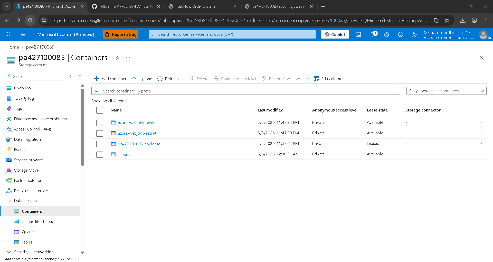

The Azure Portal storage account view for `pa427100085` displayed the `reports` blob container with a creation timestamp, confirming the destination for generated PDF files had been provisioned before the first ACI run. The `report_activity` function constructed the output blob URL as `{STORAGE_ACCOUNT_URL}/reports/{order_id}.pdf`, and the ACI `report-job` container wrote the generated PDF directly to this container using the user-assigned managed identity for authentication.

### Task 6 — Manual ACI Container Run

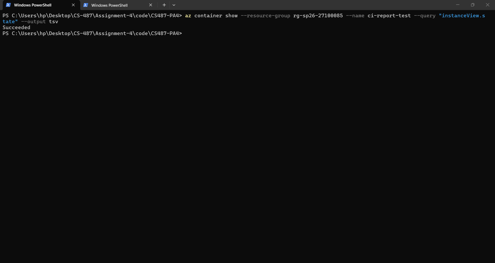

The `az container show` output for the manually triggered container instance `ci-report-test` displayed a final instance state of Succeeded with exit code 0, confirming the one-shot report job completed its PDF generation and blob upload work and exited cleanly. The Succeeded terminal state demonstrated that the `report-job:v1` image executed all steps successfully before the process terminated, as expected for a batch workload with no persistent process.

### Task 6 — ACI Container Logs

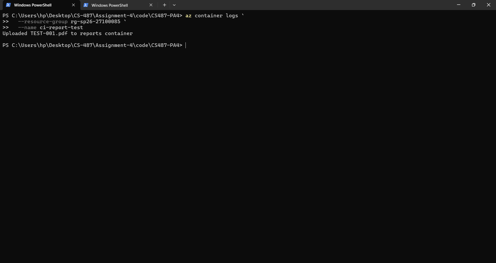

The `az container logs` output for `ci-report-test` displayed the report job's standard output, including log lines for parsing the `ORDER_JSON` environment variable, generating the PDF document, and uploading it to the `reports` container in storage account `pa427100085`. The final log lines confirmed the ACI container received order data through environment variables injected by `report_activity`, produced the PDF, and wrote it to blob storage before exiting.

### Task 6 — Generated PDF in Blob Storage

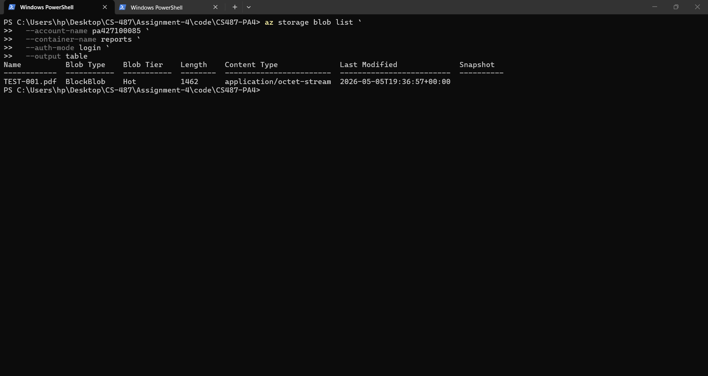

The blob list output for the `reports` container in `pa427100085` showed `TEST-001.pdf` present with a creation timestamp matching the manual ACI run, proving the `report-job` container instance had successfully written the generated PDF to Azure Blob Storage. The file's presence confirmed the ACI container used the managed identity client ID passed via `AZURE_CLIENT_ID` to authenticate to storage without a static connection string.

### Task 6 — Managed Identity and IAM

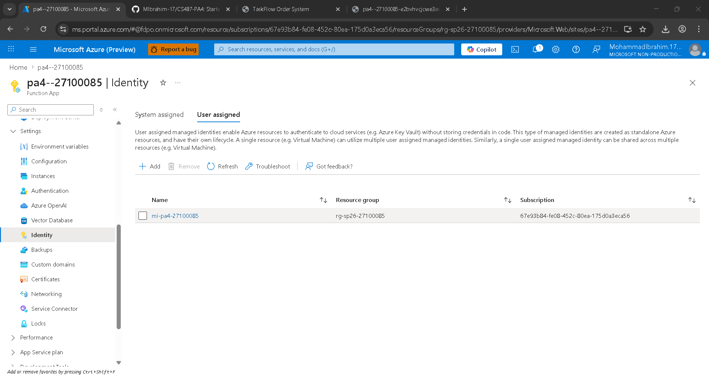

The managed identity details showed `mi-pa4-27100085` assigned a Contributor role scoped to resource group `rg-sp26-27100085`, granting the Function App the permission required to call `client.container_groups.begin_create_or_update` via the Azure Container Instance Management SDK inside `report_activity`. Without this role assignment, `report_activity` would receive a 403 Forbidden error when attempting to provision the per-order ACI container group.

### Task 6 — Report-Related App Settings

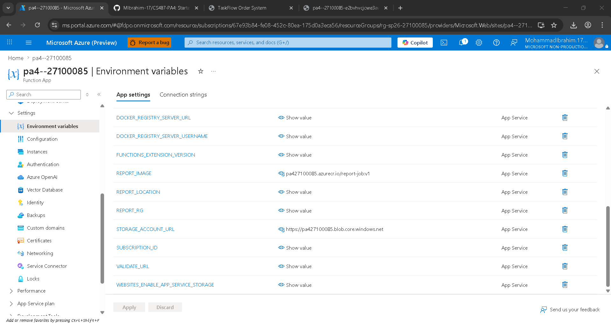

The first application settings page for `pa4--27100085` displayed the `REPORT_RG`, `REPORT_LOCATION`, and `REPORT_IMAGE` variables used by `report_activity` to create the ACI container group in resource group `rg-sp26-27100085` in UK West using the `pa427100085.azurecr.io/report-job:v1` image. Also visible were the `ACR_SERVER`, `ACR_USERNAME`, and `ACR_PASSWORD` settings that the `ImageRegistryCredential` object used to authenticate ACI's pull of the `report-job` image from the private registry; secrets were masked.

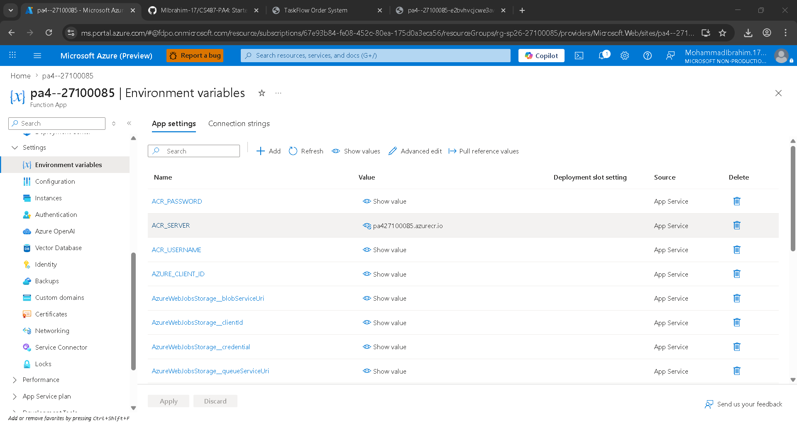

The second application settings page showed `STORAGE_ACCOUNT_URL` pointing to the `pa427100085` blob service endpoint — passed to the ACI container so the report job could write the PDF — `AZURE_CLIENT_ID` carrying the managed identity client ID so `DefaultAzureCredential` inside the container could authenticate to Blob Storage, and `SUBSCRIPTION_ID` used by `ContainerInstanceManagementClient` to scope API calls to the correct subscription; secrets were masked. Together these settings enabled `report_activity` to provision a fully authenticated, per-order ACI container without embedding static credentials anywhere in the pipeline.

---

## Task 7: End-to-End Pipeline (15 points)

### Task 7 — Web App Function URL Wiring

The App Service application settings page displayed `FUNCTION_START_URL` set to the `http_starter` endpoint on `pa4--27100085-e2bvhvcjcwe3awdw.ukwest-01.azurewebsites.net` and `FUNCTION_STATUS_URL` for polling the Durable orchestration status via `statusQueryGetUri`. The Node.js Express server in `webapp/server.js` read these variables at runtime, enabling the frontend to POST a new order to start an orchestration and then poll for completion without hard-coding any Function App endpoint.

### Task 7 — Happy Path UI Flow

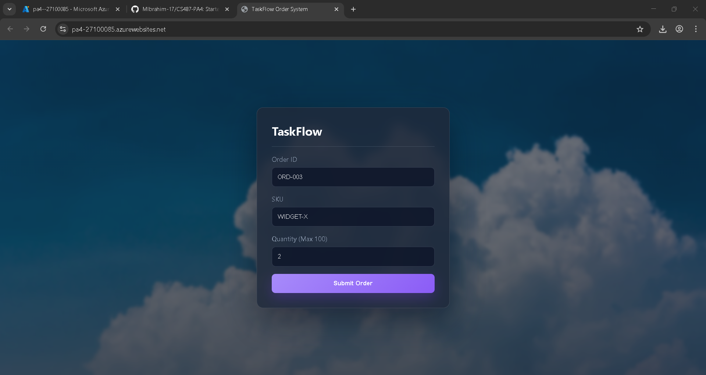

The TaskFlow dashboard displayed the order submission form pre-filled with a valid payload — product name, quantity within the accepted range, and customer details — before the Submit button was clicked. This captured the initial state of the happy-path end-to-end test.

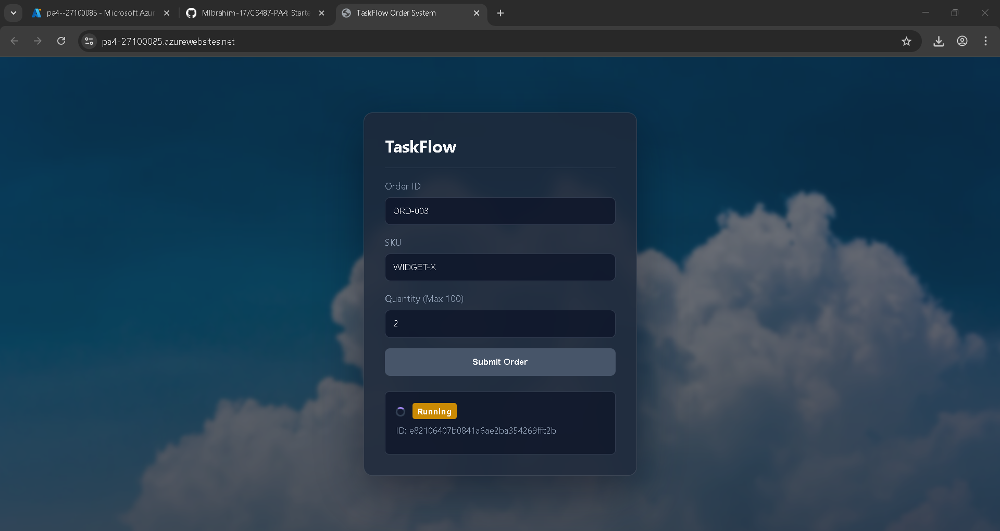

Immediately after submission, the dashboard showed the order status as Running, confirming the Web App had successfully called `FUNCTION_START_URL` and the Durable runtime had accepted the trigger, created a new orchestration instance, and begun executing the `validate_activity` step.

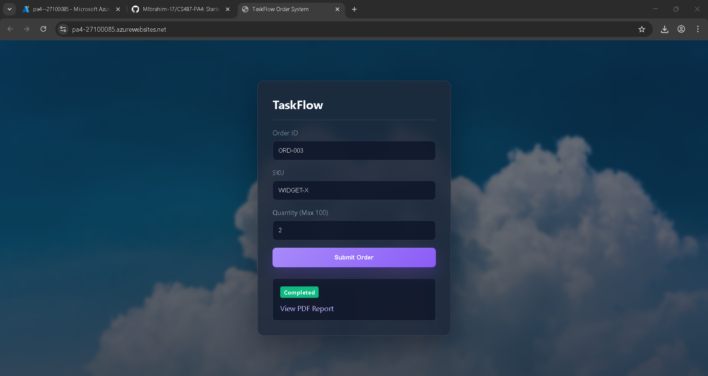

The dashboard transitioned to a Completed status with a PDF download link constructed from the blob URL returned by `report_activity`, confirming the full orchestration pipeline succeeded: the AKS validator approved the order, an ACI container generated the PDF, the blob URL `{STORAGE_ACCOUNT_URL}/reports/{order_id}.pdf` was returned to the orchestrator, and the frontend's status-polling loop surfaced it to the user.

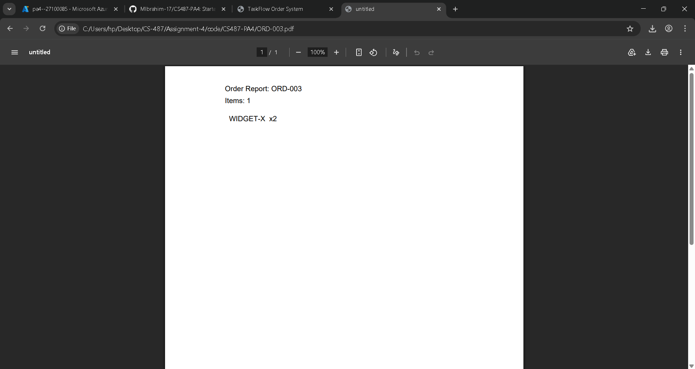

The generated PDF opened from the blob storage URL displayed in the dashboard, showing report content that matched the submitted order details and confirming the file was publicly accessible from the `reports` container in storage account `pa427100085`. This proved the complete data path from the order form through the Durable orchestrator and ACI report job to the final downloadable artifact was functioning end to end.

### Task 7 — Backend Service Participation

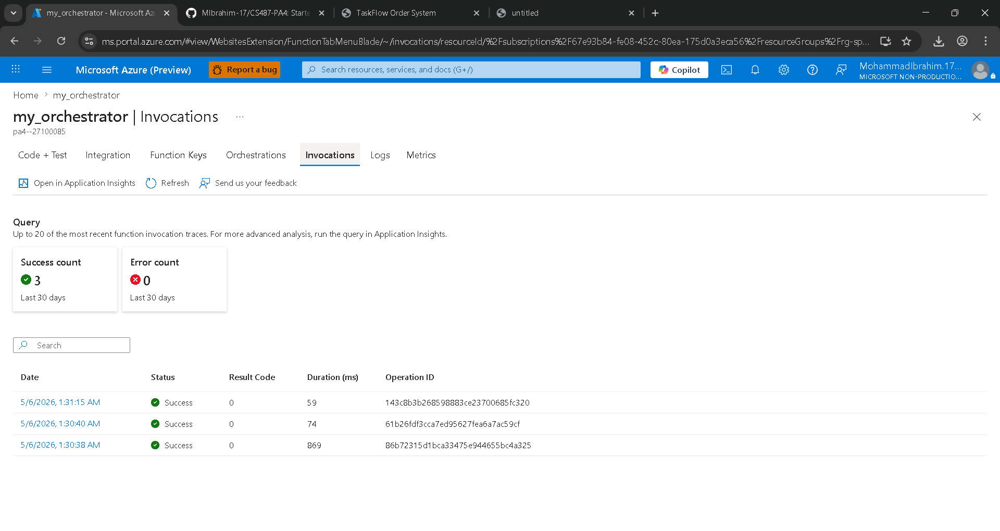

The Function App invocation log displayed the `my_orchestrator` instance triggered for the submitted order, confirming the orchestrator ran to completion without a top-level runtime error. The orchestration ID visible in the log matched the ID returned to the Web App's status polling loop, tracing the same order across the frontend and the Durable backend.

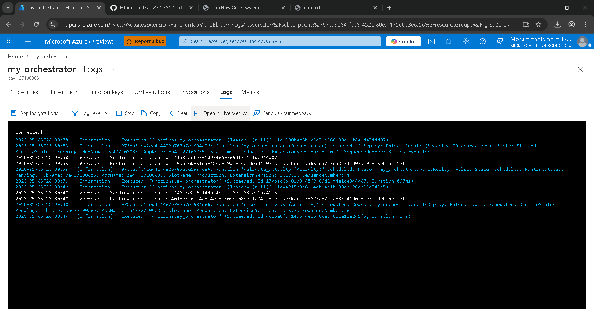

The orchestrator execution logs showed the sequential activity chain: `validate_activity` was called first and returned `{"valid": true}`, after which `report_activity` was invoked and used `ContainerInstanceManagementClient` to create the ACI container group. These log lines confirmed the conditional branch in `my_orchestrator` — `if not validation.get("valid")` — was evaluated correctly and the report step only executed after a successful validation.

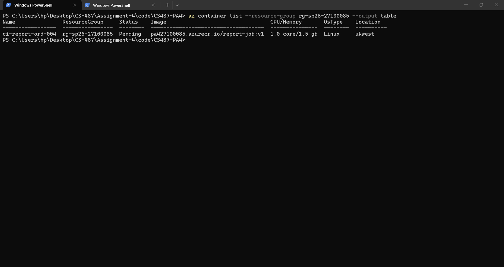

The output showed an ACI container group named with the order ID prefix — constructed as `f"ci-report-{order_id.lower()}"` in `report_activity` — created within resource group `rg-sp26-27100085`, confirming the orchestrator dynamically provisioned a dedicated per-order ACI instance rather than reusing any persistent container. The container group used the `report-job:v1` image from `pa427100085.azurecr.io` and the `mi-pa4-27100085` user-assigned identity for storage authentication.

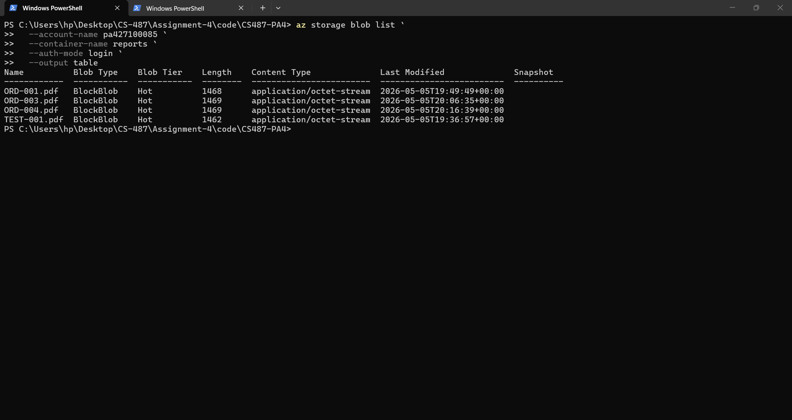

The `reports` blob container in `pa427100085` displayed the PDF file for the submitted order with a blob name matching the order ID from the orchestration, confirming the ACI container wrote the report to the correct storage location after `report_activity` waited for the container to reach a Succeeded or Failed terminal state. The file's timestamp fell within the ACI container's execution window, closing the evidence chain from order submission through the Durable orchestrator to the generated PDF artifact.

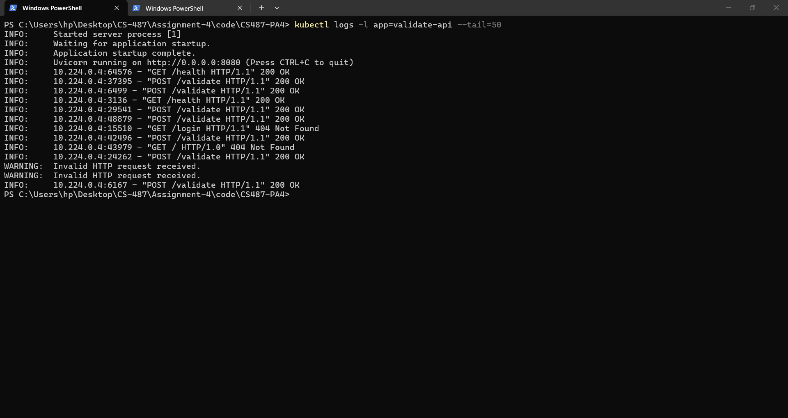

The AKS validator pod logs or access logs showed an inbound POST request to `/validate` arriving from the Durable Function's `validate_activity`, confirming all four pipeline services — App Service, Durable Function, AKS, and ACI — participated in processing the happy-path order. The request's arrival timestamp corresponded to the orchestration execution time visible in the Function App invocation logs.

### Task 7 — Reject Path UI

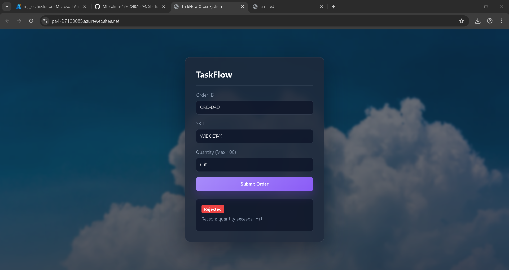

The TaskFlow dashboard displayed a Rejected status with the rejection reason returned by the AKS validator for an order submitted with `qty > 100`, confirming `validate_activity` received `{"valid": false, "reason": ...}` from the AKS `/validate` endpoint and the orchestrator returned `{"status": "rejected", "reason": ...}` without calling `report_activity`. The Web App's polling loop surfaced this payload correctly, showing the reason to the user without a page error.

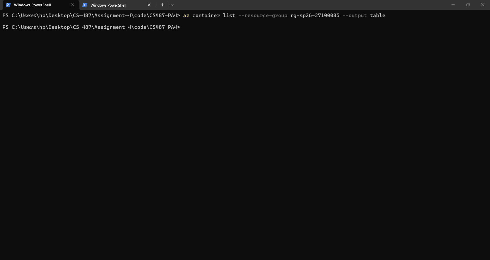

The output confirmed no new ACI container group was created during the reject-path test, proving that the `if not validation.get("valid"): return {...}` early-exit branch in `my_orchestrator` prevented `report_activity` from being called. This demonstrated that no unnecessary compute cost was incurred for invalid orders and the orchestrator's conditional logic correctly gated the report generation step on the validator's response.

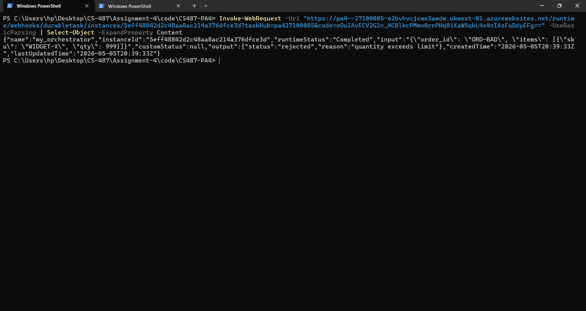

The Durable status query for the rejected orchestration instance returned a Completed runtime status with a custom output payload of `{"status": "rejected", "reason": ...}`, confirming the orchestrator terminated cleanly on the reject path without a runtime exception. The Completed status with a rejection payload proved the rejection was a deliberate orchestrator decision rather than an unhandled failure, and the full round-trip from form submission to rejection display worked correctly.

### Task 7 — Complete Resource Group Overview

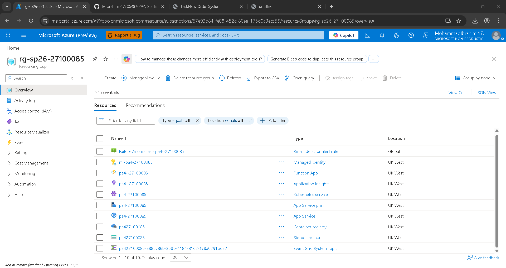

The Azure Portal resource group overview for `rg-sp26-27100085` displayed all provisioned resources including the `pa4-27100085` Web App, `pa4--27100085` Function App, `pa427100085` ACR, `pa4-27100085` AKS cluster, `pa427100085` storage account, `mi-pa4-27100085` managed identity, and the ACI container instance created during the pipeline test. This single view confirmed the complete TaskFlow infrastructure was deployed and operational within the assigned UK West resource group.

---

## Task 8: Write-up and Architecture Diagram (5 points)

### Task 8 — Architecture Diagram

Architecture diagram — to be added at docs/architecture.png

The diagram will illustrate the complete TaskFlow pipeline: a GitHub push triggers a GitHub Actions workflow that deploys to the `pa4-27100085` App Service Web App; the Web App calls the `http_starter` endpoint on `pa4--27100085`; the `my_orchestrator` function calls the AKS `validate-api` LoadBalancer service and, on approval, invokes `report_activity` which creates a per-order ACI instance pulling `report-job:v1` from `pa427100085.azurecr.io` and writing a PDF to the `reports` blob container in `pa427100085` storage; the `mi-pa4-27100085` managed identity grants the Function App permission to create ACIs and access storage without static credentials anywhere in the chain.

### Question 8.2: Service Selection

**App Service:** App Service is the right choice for the TaskFlow web UI because it provides a fully managed platform with built-in CI/CD from GitHub, eliminating server management overhead. It supports long-running Node.js processes with persistent connections, which suits a dashboard that polls orchestration status over time. The B1 SKU provides predictable billing for a frontend that receives moderate steady traffic rather than bursty workloads, and deployment rollbacks are one click away in the Deployment Center.

**Durable Functions:** Durable Functions coordinates the multi-step TaskFlow pipeline because it persists orchestration state between activities, meaning a crash or timeout during report generation does not restart the entire flow from validation. Plain HTTP-triggered functions cannot checkpoint state, making long-running sequential workflows fragile and prone to timeout errors. The containerised deployment on the existing App Service plan avoids cold starts while keeping infrastructure costs minimal by reusing already-allocated compute.

**AKS:** The validator runs on AKS because it is a long-lived HTTP microservice that must respond within milliseconds on every order submission, requiring a stable always-running endpoint rather than a scale-to-zero serverless model. AKS provides declarative Kubernetes manifests, a LoadBalancer service for a stable external IP, and fine-grained resource controls such as CPU and memory requests per pod. For an enterprise team this pattern is the industry standard for running stateless microservices that must handle sustained concurrent traffic with predictable latency.

**ACI:** The report generator runs on ACI because it is a short-lived batch job that starts, writes a PDF to blob storage, and exits with no idle period and no need for a persistent endpoint. ACI bills only for the seconds the container is alive, making per-order cost negligible when no orders are being processed. Keeping this workload off the AKS cluster avoids wasting node resources on a job that runs for roughly 20 seconds per order and then disappears.

### Question 8.3: ACI vs AKS

When the AKS cluster is idle for 10 minutes the single Standard_B2s node continues running and billing at its hourly VM rate because Kubernetes does not terminate nodes based on traffic absence — the node stays ready to serve the next validate request immediately. ACI has no concept of idle in this pipeline: each container is created fresh per order by the Durable orchestrator, runs for approximately 20 seconds, and is deleted by `report_activity`, so there is zero cost between orders. If a malicious user spammed the Submit button 1000 times in a minute, ACI would incur the most cost because 1000 separate container instances would be created and billed individually, whereas the AKS node cost remains fixed at its hourly VM rate regardless of request volume.

### Question 8.4: Durable Functions vs Plain HTTP

If the same flow were implemented as two plain HTTP functions calling each other, the first function would need to wait synchronously for the report ACI to finish — which takes up to 60 seconds — exceeding the default HTTP timeout of most serverless runtimes and causing a 5xx error before the work completes. Additionally, if the runtime recycled the host process mid-execution all orchestration state would be lost since it lives only in memory, forcing the entire order to be resubmitted with no guarantee against double-reporting. Durable Functions solves both problems by checkpointing after every activity into Azure Storage, allowing the orchestrator to replay safely from the last successful step without re-executing completed activities.

### Question 8.5: Cost Review

Cost Management access was not available during this assignment as the required Reader role on the billing scope was not granted on the instructor's subscription. Based on resource usage, the AKS cluster running a single Standard_B2s node continuously was the single most expensive resource, as it bills at the VM hourly rate regardless of whether any orders are being processed. The Durable Function App and Web App share the existing B1 App Service plan adding no extra compute cost. ACI costs were minimal as each report container ran for approximately 20 seconds per order and was immediately deleted by the orchestrator.

### Question 8.6: Challenges Faced

**Challenge 1 — GitHub Actions webapp deployment:** The auto-generated workflow failed with exit code 254 because it did not account for the Node.js app living inside the `webapp/` subfolder rather than the repo root. The workflow zipped the `webapp/` directory as a nested folder so Azure deployed `server.js` at the path `webapp/server.js` instead of the root, causing a `Cannot GET /` error in the browser. The fix was to rewrite the workflow to zip the contents of `webapp/` directly and set the App Service startup command to `node webapp/server.js`.

**Challenge 2 — Function App storage auth crash:** The Function App crashed immediately after creation because the instructor's subscription security policy blocks default `AzureWebJobsStorage` connection strings. Debugging required reading the container startup logs and cross-referencing the instructor's note about managed identity storage auth. The fix was to attach the pre-provisioned managed identity `mi-pa4-27100085` and replace the single `AzureWebJobsStorage` connection string with three separate settings using `accountName`, `credential=managedidentity`, and `clientId`.

**Challenge 3 — PowerShell JSON quoting for ACI environment variables:** The manual ACI test failed with a `JSONDecodeError` inside the report container because PowerShell strips double quotes from variables when expanded inside double-quoted strings passed to `az` CLI. The `ORDER_JSON` environment variable arrived at the container with single quotes making it invalid JSON. The fix was to pre-escape the JSON using backslash-quote notation in the PowerShell variable before passing it to the `az container create` command.

---
